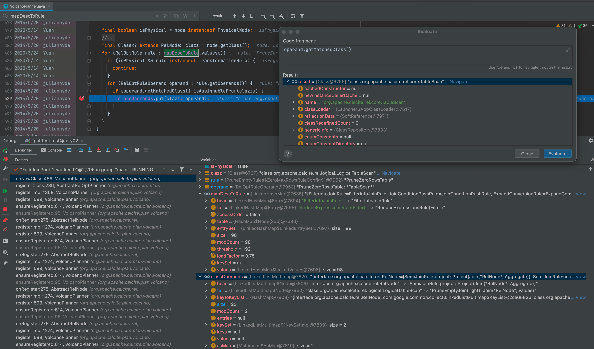
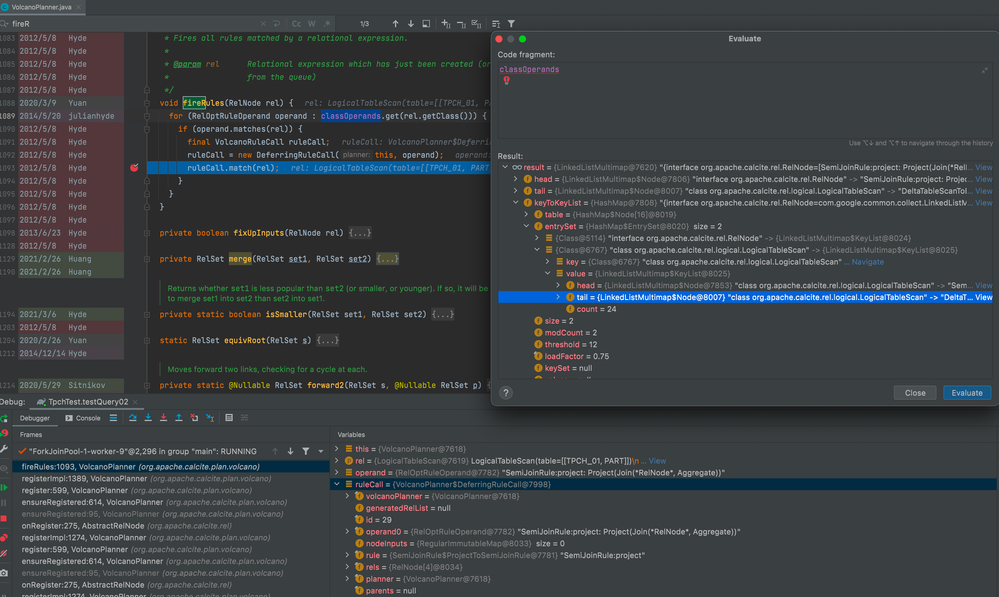
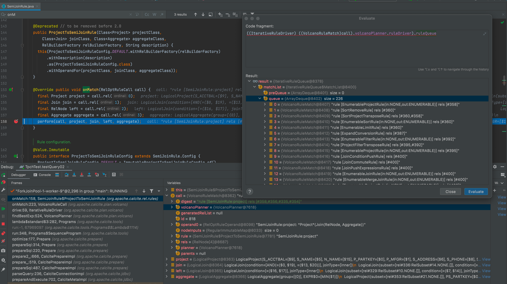

# How does VolcanoPlanner Works?

I only introduced the key points about CBO, you can know which rule produce which node and why chose it.

There are other features that have not been introduced,
such as [materialized-view]((https://issues.apache.org/jira/browse/CALCITE-2465)) rewriting and [top-down](https://issues.apache.org/jira/browse/CALCITE-3916) rule applying.

## Register RelNode
There is `root` filed in VolcanoPlanner, it is the starting point for recursive access.
```java
  org.apache.calcite.plan.volcano.VolcanoPlanner.onNewClass(VolcanoPlanner.java:484)
  org.apache.calcite.plan.AbstractRelOptPlanner.registerClass(AbstractRelOptPlanner.java:236)
  org.apache.calcite.plan.volcano.VolcanoPlanner.registerImpl(VolcanoPlanner.java:1368)
    
  org.apache.calcite.plan.volcano.VolcanoPlanner.register(VolcanoPlanner.java:599)
  org.apache.calcite.plan.volcano.VolcanoPlanner.ensureRegistered(VolcanoPlanner.java:614)
  org.apache.calcite.plan.volcano.VolcanoPlanner.ensureRegistered(VolcanoPlanner.java:95)
  org.apache.calcite.rel.AbstractRelNode.onRegister(AbstractRelNode.java:275)
  org.apache.calcite.plan.volcano.VolcanoPlanner.registerImpl(VolcanoPlanner.java:1274)
  ...
  org.apache.calcite.plan.volcano.VolcanoPlanner.register(VolcanoPlanner.java:599)
  org.apache.calcite.plan.volcano.VolcanoPlanner.ensureRegistered(VolcanoPlanner.java:614)
  org.apache.calcite.plan.volcano.VolcanoPlanner.ensureRegistered(VolcanoPlanner.java:95)
  org.apache.calcite.rel.AbstractRelNode.onRegister(AbstractRelNode.java:275)
  org.apache.calcite.plan.volcano.VolcanoPlanner.registerImpl(VolcanoPlanner.java:1274)
  ...
  org.apache.calcite.plan.volcano.VolcanoPlanner.setRoot(VolcanoPlanner.java:274)
  ...
```
Every RelNode will be registered in VolcanoPlanner.

## Apply Rule 
Users add many rules to `mapDigestToRel` that is field in VolcanoPlanner. \
To reduce the matching of useless rules, there are two steps. \
Those matched rules will be push to queue and pop on by one.
1. Matched class filter unrelated rules

Add `RelNode` and `RelOptRuleOperand` to `classOperands` if the RelNode that being registered is instance of target class.


2. Push to queue if RelNode matched rule

Build an `DeferringRuleCall` if RelNode Instance match the rule. 

The `DeferringRuleCall` will be bind as `VolcanoRuleMatch`. 

```java
  private static class DeferringRuleCall extends VolcanoRuleCall {
    DeferringRuleCall(
        VolcanoPlanner planner,
        RelOptRuleOperand operand) {
      super(planner, operand);
    }

    /**
     * Rather than invoking the rule (as the base method does), creates a
     * {@link VolcanoRuleMatch} which can be invoked later.
     */
    @Override protected void onMatch() {
      final VolcanoRuleMatch match =
          new VolcanoRuleMatch(
              volcanoPlanner,
              getOperand0(),
              rels,
              nodeInputs);
      volcanoPlanner.ruleDriver.getRuleQueue().addMatch(match);
    }
  }
```
Then push the `VolcanoRuleMatch` to the queue.

3. Pop queue and trigger `DeferringRuleCall`

Here is Volcano Planner use `SemiJoinRule` demo, and there are many others rule in queue.



`RelOptRuleCall` is key object when we write optimize rule, `DeferringRuleCall` is subclass of that.


## Estimate Cost 
### computeSelfCost
`org.apache.calcite.rel.AbstractRelNode#computeSelfCost` is top level interface.
```java
  @Override public @Nullable RelOptCost computeSelfCost(RelOptPlanner planner,
      RelMetadataQuery mq) {
    // by default, assume cost is proportional to number of rows
    double rowCount = mq.getRowCount(this);
    return planner.getCostFactory().makeCost(rowCount, rowCount, 0);
  }
```

There are many RelNodes overwrite the interface.
- [TableScan](https://github.com/apache/calcite/blob/c49792f9c72159571f898c5fca1e26cba9870b07/core/src/main/java/org/apache/calcite/rel/core/TableScan.java#L103)
- [Project](https://github.com/apache/calcite/blob/c49792f9c72159571f898c5fca1e26cba9870b07/core/src/main/java/org/apache/calcite/rel/core/Project.java#L284)
- [Join](https://github.com/apache/calcite/blob/c49792f9c72159571f898c5fca1e26cba9870b07/core/src/main/java/org/apache/calcite/rel/core/Join.java#L185)

- ...

They only have simple computational logic. 
We can customize complex computational logic, for example:
- [EnumerableHashJoin](https://github.com/apache/calcite/blob/c49792f9c72159571f898c5fca1e26cba9870b07/core/src/main/java/org/apache/calcite/adapter/enumerable/EnumerableHashJoin.java#L129)
- [EnumerableNestedLoopJoin](https://github.com/apache/calcite/blob/c49792f9c72159571f898c5fca1e26cba9870b07/core/src/main/java/org/apache/calcite/adapter/enumerable/EnumerableNestedLoopJoin.java#L90)
- [EnumerableMergeJoin](https://github.com/apache/calcite/blob/c49792f9c72159571f898c5fca1e26cba9870b07/core/src/main/java/org/apache/calcite/adapter/enumerable/EnumerableMergeJoin.java#L422)
- ...

In fact, many computing engines have their own computing logic.
- [Druid](https://github.com/search?q=repo%3Aapache%2Fdruid%20computeSelfCost&type=code)
- [Flink](https://github.com/search?q=repo%3Aapache%2Fflink+computeSelfCost&type=code)
- [Kylin](https://github.com/search?q=repo%3Aapache%2Fkylin%20computeSelfCost&type=code)
- ...

### RelMetadataQuery
`computeSelfCost` always needs one parameter that is instance of RelMetadataQuery.

RelMetadataQuery provides **RowCount** and **Selectivity** to compute cost.
> RelMetadataQuery also provides other information that is not for cost.
- [RelMdRowCount](https://github.com/apache/calcite/blob/c49792f9c72159571f898c5fca1e26cba9870b07/core/src/main/java/org/apache/calcite/rel/metadata/RelMdRowCount.java)
- [RelMdSelectivity](https://github.com/apache/calcite/blob/c49792f9c72159571f898c5fca1e26cba9870b07/core/src/main/java/org/apache/calcite/rel/metadata/RelMdSelectivity.java)

We can also have custom implementations like Flink.
- [FlinkRelMdRowCount](https://github.com/apache/flink/blob/faacf7e28bd9a43723303d0bd4a6ee9adebcb5bb/flink-table/flink-table-planner/src/main/scala/org/apache/flink/table/planner/plan/metadata/FlinkRelMdRowCount.scala)
- [FlinkRelMdSelectivity](https://github.com/apache/flink/blob/faacf7e28bd9a43723303d0bd4a6ee9adebcb5bb/flink-table/flink-table-planner/src/main/scala/org/apache/flink/table/planner/plan/metadata/FlinkRelMdSelectivity.scala#L41)


## findBestExp
Volcano Planner places the equivalent RelNode in a RelSubSet. \
The RelSubSet record the current best cost.
```java
  private void computeBestCost(
      @UnderInitialization RelSubset this,
      RelOptCluster cluster,
      RelOptPlanner planner) {
    bestCost = planner.getCostFactory().makeInfiniteCost();
    final RelMetadataQuery mq = cluster.getMetadataQuery();
    @SuppressWarnings("method.invocation.invalid")
    Iterable<RelNode> rels = getRels();
    for (RelNode rel : rels) {
      final RelOptCost cost = planner.getCost(rel, mq);
      if (cost == null) {
        continue;
      }
      if (cost.isLt(bestCost)) {
        bestCost = cost;
        best = rel;
      }
    }
  }
```
In the end, we will use the best cost in all RelSubSet.

# Summary

First, Volcano Planner register root RelNode and apply optimized rules create new RelNode(will be register again). \
Then, Volcano Planner compute cost for every RelNode. \
Last, find the best cost RelNode.